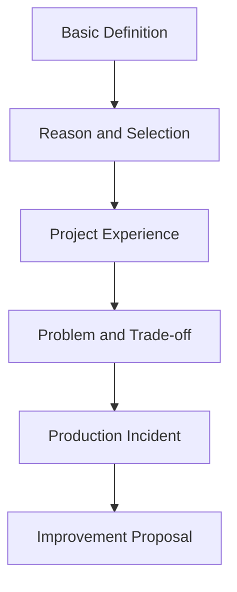

# Question Bank Roadmap

## Overview

이 문서는 최종적으로 400개 이상의 예상 질문과 1000개 이상의 꼬리질문을 만들기 위한 질문 설계표다.

---

## Target Distribution

| Category | Expected Questions | Follow-up Questions |
|---|---:|---:|
| Profile / Career | 40 | 120 |
| Java | 70 | 180 |
| Spring Boot | 70 | 180 |
| Database | 50 | 130 |
| AWS / Infrastructure | 45 | 120 |
| AI-driven Development | 45 | 120 |
| Tokyo-Sane | 40 | 120 |
| STAR / Behavioral | 50 | 150 |
| Company-specific | 50 | 150 |
| Reverse Questions | 20 | 50 |
| Total | 480 | 1320 |

---

## Question Depth Model

---

## Example: Redis

| Depth | Question |
|---|---|
| Basic | Redisとは何ですか。 |
| Intermediate | なぜローカルキャッシュではなくRedisを使いますか。 |
| Advanced | キャッシュとDBの整合性はどう担保しますか。 |
| Expert | 本番環境でキャッシュが原因の問題が起きたらどう調査しますか。 |
| Architect | 今の設計を改善するならどうしますか。 |

---

## Initial High-priority Questions

### Profile

- 自己紹介をお願いします。
- これまでの職務経歴を簡単に説明してください。
- なぜ日本で働こうと思いましたか。
- なぜ転職を考えていますか。
- 今後どのようなエンジニアになりたいですか。

### Java

- Javaの特徴を説明してください。
- オブジェクト指向とは何ですか。
- `equals`と`hashCode`の関係を説明してください。
- `ArrayList`と`LinkedList`の違いは何ですか。
- 例外処理で意識していることは何ですか。

### Spring

- Spring Bootを使うメリットは何ですか。
- DIとは何ですか。
- `@Transactional`の注意点を説明してください。
- Spring Securityで認証・認可をどう設計しますか。
- Controller, Service, Repositoryの責務を説明してください。

### AI

- AI主導開発とは何ですか。
- Claude Codeをどのように活用しましたか。
- Rules, Agents, Skillsをどう使い分けましたか。
- AIレビューで品質をどう担保しましたか。
- AIの出力をそのまま使わないために何をしていますか。

### Tokyo-Sane

- Tokyo-Saneの概要を説明してください。
- なぜその技術スタックを選びましたか。
- AI主導開発でどのように期間短縮しましたか。
- セキュリティ面で意識したことは何ですか。
- 今後改善するならどこを改善しますか。

