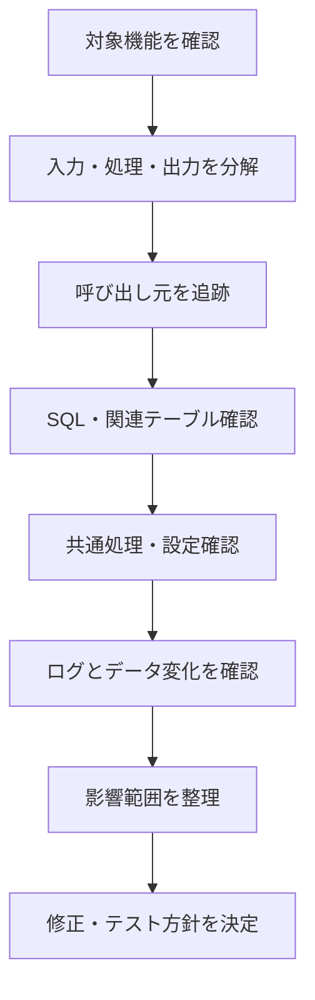
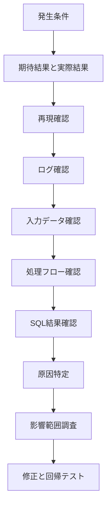

# 職務経歴

## Overview

이 문서는 직무경력서와 면접준비 문서를 기반으로, 일본 면접에서 경력을 설명하기 위한 답변을 정리한다.

경력 설명의 핵심은 시간순 나열이 아니라, 다음 두 축으로 정리하는 것이다.

1. 고객사 업무 시스템 개발 경험
2. HRMS / Tokyo-Sane을 통한 리더십・AI 주도 개발 경험

---

## Career Summary

| Period | Company / Project | Domain | Main Role | Technologies |
|---|---|---|---|---|
| 2021-01 ~ 2022-11 | 食品製造会社 S社 | 勤怠管理 | 開発・保守 | C#, ASP.NET Core, SQL Server |
| 2022-12 ~ 2023-05 | 医療機関 M社 | 医療 | 保守開発 | C#, Oracle, AWS |
| 2023-06 ~ 2023-09 | 物流会社 S社 | WMS | 詳細設計・実装 | Java 17, PL/SQL, Oracle |
| 2023-10 ~ 2024-07 | 不動産会社 D社 | 会計刷新 | 調査・基本設計・詳細設計 | VB.NET, Java 18, Oracle |
| 2024-08 ~ 現在 | 金融機関 M社 | 金融 | 設計・実装・テスト | Java 17, Oracle, AWS |
| 2024-02 ~ 2025-04 | HRMS | 勤怠管理 | Sub Leader / Leader | Spring Boot, React, PostgreSQL, Redis |
| 2025-04 ~ 2026-04 | Tokyo-Sane | EC | Main Developer / Leader | Spring Boot, React, MyBatis, AWS |

---

## Important Concepts

| Concept | Explanation |
|---|---|
| 業務システム開発 | 금융・부동산・물류・의료 등 업무 규칙이 중요한 시스템 |
| 上流工程 | 기존 업무 분석, 기본설계, 상세설계 |
| 品質 | 금융 프로젝트의 불具合検出, 테스트, 영향 범위 조사 |
| Leadership | HRMS에서 개발方針, 코드 리뷰, 진척 관리 |
| AI-driven Development | Claude Code 기반 Rules, Agents, Skills 설계 |
| Adaptability | 한국/일본, 다양한 도메인, 새로운 기술에 적응 |

---

## Expected Questions

| Category | Japanese Question |
|---|---|
| Career | これまでのご経歴について、簡単に教えてください。 |
| Project | 一番経験が深いプロジェクトは何ですか。 |
| Finance | 金融案件ではどのような役割を担当しましたか。 |
| Leadership | リーダーまたはサブリーダーとしての経験について教えてください。 |
| AI | AI主導開発に取り組んだ経験を教えてください。 |
| Trouble | 最も苦労したプロジェクトと、それをどう乗り越えたか教えてください。 |
| Future | 今後どのような役割を担当したいですか。 |

---

## Interviewer's Intent

면접관은 직무경력 설명에서 다음을 확인한다.

- 경력을 구조적으로 설명할 수 있는가
- 실제 담당 범위가 어디까지였는가
- Java/Spring 경험이 충분한가
- 금융/HRMS/Tokyo-Sane 중 깊게 물어볼 프로젝트가 있는가
- 품질, 일정, 커뮤니케이션, 리더십 관점이 있는가
- AI 경험을 실무 개발 프로세스와 연결할 수 있는가

---

## Japanese Model Answers

### Q1. これまでのご経歴について、簡単に教えてください。

```text
韓国でITエンジニアとしてキャリアをスタートした後、日本へ転職し、
現在までさまざまな業務システム開発を経験してきました。

初期には、C#とASP.NET Coreを使用した勤怠管理システムで、
管理画面、CSV入出力機能、テスト、保守対応などを担当しました。
その後、医療機関向け患者管理システムでは、既存システムの調査、
不具合原因の分析、機能改修を経験しました。

日本では、不動産、物流、金融関連のシステム開発に参画しました。
直近の金融機関向けプロジェクトでは、Java 17とOracleを使用し、
有価証券管理やローン返済照会システムのバッチ機能を開発しました。
詳細設計からシナリオテスト、不具合原因や影響範囲の調査まで担当しております。

また、これらの業務と並行して、社内HRMSプロジェクトとTokyo-Saneの自主開発を通じて、
Spring Boot、React、AWS、CI/CD、AI主導開発の経験を積みました。
```

### Q2. 職務経歴を大きく分けると、どのように説明できますか。

```text
私の職務経歴は、大きく二つに分けて説明できます。

一つ目は、顧客先での業務システム開発経験です。
金融、不動産、物流、医療、勤怠管理など複数の業務領域で、
詳細設計、実装、テスト、保守運用を中心に担当してまいりました。

特に直近の金融案件では、Javaを用いたバッチ処理の詳細設計・実装、
OracleでのSQL作成、データ調査、単体テスト、結合テストを担当しました。
テスト工程では20件以上の不具合や潜在的な問題を検出し、品質向上に貢献しました。

二つ目は、社内サイドプロジェクトおよび自主開発でのリーダー経験です。
HRMSやTokyo-Saneでは、Spring Boot、React、PostgreSQL、Redis、AWSを用いて、
Webアプリケーションの設計・開発、CI/CD、AI活用プロセスの整備まで担当しました。

この経験を通じて、単に実装するだけではなく、
業務理解、設計、品質、チーム開発プロセスを意識して開発する姿勢を身につけました。
```

### Q3. 金融案件ではどのような役割を担当しましたか。

```text
直近の金融機関向けプロジェクトでは、
有価証券管理、債券管理、ローン返済照会システムの開発に携わりました。

主にJava 17とOracleを使用し、バッチ機能の詳細設計、実装、
SQL作成、単体テスト、結合テスト、シナリオテストを担当しました。

金融システムでは、データの正確性と既存機能への影響確認が非常に重要です。
そのため、実装だけでなく、入力データ、処理順序、出力結果、
他機能への影響範囲を確認しながら作業を進めました。

テスト工程では、正常系だけでなく境界値や例外パターンも確認し、
20件以上の不具合や潜在的な不具合を検出しました。
また、担当機能を予定より約2週間前倒しで完了し、後続工程の円滑な進行に貢献しました。
```

### Q4. リーダーまたはサブリーダーとしての経験について教えてください。

```text
社内HRMSプロジェクトで、前半はサブリーダー、後半はリーダーを担当しました。

主な役割は、開発方針の策定、作業分担、進捗確認、コードレビュー、
技術的な課題を抱えているメンバーへの支援です。

特に、メンバーごとに実装方法が異なる問題を減らすため、
認証、例外処理、APIレスポンス、レビュー基準などを整理して共有しました。

AIツールについても、コード生成だけではなく、レビュー観点の整理、
実装案の比較、エラー原因候補の分析、メンバーへの説明資料作成などに活用しました。
ただし、最終的な設計判断と品質判断は、必ず担当者が確認する方針としました。

リーダーとして重視したのは、すべてを自分で対応することではなく、
メンバーが共通の基準で判断し、安定して開発できる環境を作ることでした。
```

### Q5. 最も苦労したプロジェクトと、それをどのように乗り越えたか教えてください。

```text
直近の金融機関向けプロジェクトで、既存のバッチ機能を分析し、
改修する業務に最も苦労しました。

金融システムでは、データの正確性と既存機能への影響が非常に重要なため、
要件に合わせてコードを修正するだけでは不十分でした。

まず、既存SQLとバッチ処理の流れを段階ごとに整理し、
入力データ、出力結果、他機能との連携範囲を確認しました。
その後、単体テストと結合テストでは、正常系だけではなく、
境界値や例外パターンも積極的に検証しました。

その結果、20件以上の不具合や潜在的な不具合を発見し、
原因と影響範囲を整理した上で修正しました。

この経験から、複雑な既存システムでは、実装を急ぐよりも、
最初に処理フローと影響範囲を構造的に把握することが重要だと学びました。
```

### Q6. JavaとSpringではどのような開発経験がありますか。

```text
業務プロジェクトでは、Java 17を使用して、
金融機関向け有価証券管理およびローン返済照会システムのバッチ機能を開発しました。
詳細設計書を基にバッチ処理を実装し、Oracle SQLの作成、
既存機能の改修、テストを担当しました。

HRMSとTokyo-Saneでは、Java 18、Spring Boot、Spring Security、MyBatisを使用しました。
Web API、認証・権限管理、管理者機能、Javaバッチ、
データベース連携機能を設計・実装しました。

Springでは、Controller、Service、Repositoryの責務を分離し、
例外処理、トランザクション範囲、認証・権限チェックの一貫性を重視しました。

単に機能を動作させるだけではなく、
セキュリティ、保守性、テストのしやすさを考慮した構成を意識しています。
```

### Q7. SQLおよびデータベースに関する経験を教えてください。

```text
Oracle、PostgreSQL、SQL Serverの使用経験があります。

直近の金融プロジェクトでは、Oracleを使用し、
バッチ処理に必要なSQLを作成するとともに、既存SQLとデータの関係を調査しました。
不具合が発生した際は、対象データだけではなく、
結合条件、処理順序、他テーブルへの影響まで確認しました。

HRMSと自主開発ではPostgreSQLを使用し、
Redisについてもキャッシュやデータ処理の補助として検討しました。
SQLを作成する際は、データ件数、インデックスの利用可否、実行計画を意識しています。

性能問題が発生した場合は、まず実際に実行されているSQLと条件を確認し、
不要な全件検索、非効率な結合、インデックスの適用状況を順番に調査します。
```

---

## Korean Explanation

### 경력 설명 전략

- 시간순 설명은 길어지기 쉽다.
- 먼저 “고객사 업무 시스템 경험”과 “리더십・AI 프로젝트 경험”으로 나눈다.
- 이후 면접관이 관심 있어 하는 프로젝트를 깊게 설명한다.

### 가장 강한 소재

| 소재 | 이유 |
|---|---|
| 금융 프로젝트 | Java, Oracle, 품질, 테스트, 영향 범위 조사 |
| HRMS | Spring Boot, React, 리더십, 코드 리뷰 |
| Tokyo-Sane | AI 주도 개발, AWS, CI/CD, 자율 개발 |
| 기존 시스템 분석 | 일본 SI/업무 시스템 면접에서 강함 |
| 20건 이상 불具合 검출 | 수치가 있는 품질 기여 |
| 약 2주 앞당김 | 일정 관리와 사전 정리 역량 |

---

## Follow-up Questions

### 금융 프로젝트

- バッチ処理の入力・出力はどのように確認しましたか。
- 20件以上の不具合はどのような種類でしたか。
- 影響範囲調査では何を確認しましたか。
- 金融システムで特に重要だと思うことは何ですか。
- 予定より2週間前倒しで完了できた理由は何ですか。

### HRMS / Leadership

- コードレビューでは何を重視しましたか。
- メンバーごとの実装差をどう減らしましたか。
- 進捗管理ではどのような情報を見ていましたか。
- AIをメンバー支援にどう活用しましたか。
- リーダーとして一番難しかったことは何ですか。

### Tokyo-Sane / AI

- Tokyo-Saneの概要を説明してください。
- なぜSpring BootとReactを選びましたか。
- Rules, Agents, Skillsをどう使い分けましたか。
- 18か月想定を12か月で完了できた理由は何ですか。
- AIの出力品質はどう担保しましたか。

### Common

- 新しい現場に入った時、どのように適応しますか。
- ドキュメントが少ない既存システムをどう分析しますか。
- 不具合や障害が発生した場合、どのように調査しますか。
- 担当業務が遅延する可能性がある場合、どう対応しますか。
- お客様や業務担当者とのコミュニケーションで何を重視しますか。

---

## Technical Deep Dive

### Existing System Analysis Flow



### Defect Investigation Flow



### Project Strength Map

| Project | Strong Story | Interview Use |
|---|---|---|
| 勤怠管理 C# | 첫 업무 시스템, 보수운용 | 안정적 운영 경험 |
| 医療 | 원인 분석, 기존 시스템 조사 | 장애 조사 경험 |
| 物流 WMS | Java 17, PL/SQL | 낯선 도메인 적응 |
| 不動産 | 기존 VB 분석, Java화 설계 | 상류 공정 경험 |
| 金融 | batch, Oracle, 품질 | 핵심 기술/품질 사례 |
| HRMS | leader, Spring, AI review | 리더십 사례 |
| Tokyo-Sane | AI-driven, AWS, CI/CD | 차별화 사례 |

---

## Good Answer Example

```text
私の経歴は、顧客先での業務システム開発と、HRMS・Tokyo-Saneでのリーダー経験に分けられます。
顧客先では金融、不動産、物流、医療などで、設計、実装、テスト、保守を経験しました。
特に金融案件ではJavaとOracleを使い、バッチ機能の開発とテストを担当し、20件以上の不具合や潜在的な問題を検出しました。
一方、HRMSやTokyo-SaneではSpring Boot、React、AWS、AI活用プロセスの整備にも取り組みました。
```

좋은 이유:

- 경력의 축이 명확하다.
- 고객사 경험과 자율 프로젝트 경험이 분리되어 있다.
- 수치 성과가 있다.
- Java/Spring/AI 모두 자연스럽게 연결된다.

---

## Bad Answer Example

```text
いろいろなプロジェクトを経験しました。
C#、Java、Spring、Oracle、AWS、AIなどを使いました。
テストや保守もしました。
```

문제점:

- 역할과 성과가 보이지 않는다.
- 어떤 프로젝트가 강점인지 알 수 없다.
- 기술 목록만 있고 실무 판단 기준이 없다.
- 면접관이 좋은 꼬리질문을 하기 어렵다.

---

## Answer Operation Rules

### 자사개발 회사에서 강조할 내용

- 하나의 서비스를 장기적으로 개선하고 싶다는 의지
- 요구사항부터 배포와 운영까지 전체 흐름을 경험한 점
- Tokyo-Sane 개발 경험
- AI를 서비스와 개발 프로세스에 안전하게 적용하는 능력
- 사용자와 비즈니스 관점에서 기능을 생각하는 자세

### SI 회사에서 강조할 내용

- Java, Spring, Oracle, batch 개발 경험
- 상세설계부터 테스트까지 실무 수행 능력
- 기존 시스템 분석과 영향 범위 조사 능력
- 일정 준수와 조기 보고
- 고객 및 팀 구성원과의 커뮤니케이션
- 서브리더・리더로서의 프로젝트 관리 경험

### 권장 표현

- `AIの結果を検証し、最終判断は私が担当しました。`
- `現在の会社で多くの経験を積み、次の段階の役割に挑戦したいと考えています。`
- `SIで得た多様な現場経験を、自社サービスの長期的な改善に活かしたいです。`
- `業務上必要なコミュニケーションには対応しており、より正確な表現のために継続して学習しています。`

---

## Checklist

- [ ] 경력을 시간순으로만 말하지 않는다.
- [ ] “업무 시스템 개발”과 “AI 주도 개발” 두 축으로 설명한다.
- [ ] 금융 프로젝트의 품질 기여를 말할 수 있다.
- [ ] HRMS의 리더십 경험을 말할 수 있다.
- [ ] Tokyo-Sane의 AI 주도 개발 경험을 말할 수 있다.
- [ ] Java/Spring/DB 경험을 프로젝트와 연결한다.
- [ ] 회사 유형에 따라 강조점을 바꿀 수 있다.

---

## Final View

면접 직전에 이 섹션만 보면 된다.

---

## まず覚える職務経歴

### 기본 답변

```text
私の職務経歴は、大きく二つに分けて説明できます。

一つ目は、顧客先での業務システム開発経験です。
金融、不動産、物流、医療、勤怠管理など複数の業務領域で、
詳細設計、実装、テスト、保守運用を中心に担当してまいりました。

特に直近の金融案件では、Javaを用いたバッチ処理の詳細設計・実装、
OracleでのSQL作成、データ調査、単体テスト、結合テストを担当しました。
テスト工程では20件以上の不具合や潜在的な問題を検出し、品質向上に貢献しました。

二つ目は、社内サイドプロジェクトおよび自主開発でのリーダー経験です。
HRMSやTokyo-Saneでは、Spring Boot、React、PostgreSQL、Redis、AWSを用いて、
Webアプリケーションの設計・開発、CI/CD、AI活用プロセスの整備まで担当しました。

この経験を通じて、単に実装するだけではなく、
業務理解、設計、品質、チーム開発プロセスを意識して開発する姿勢を身につけました。
```

---

## 경력은 이렇게 보면 된다

| 축 | 핵심 | 대표 프로젝트 | 면접에서 보여줄 것 |
|---|---|---|---|
| 1 | 고객사 업무 시스템 | 金融, 不動産, 物流, 医療 | 실무 수행력 |
| 2 | Java / DB | 金融, 物流 | 백엔드 기본기 |
| 3 | 품질 개선 | 金融 | 20건 이상 불具合 검출 |
| 4 | 리더십 | HRMS | 리뷰, 진척관리, 멤버 지원 |
| 5 | AI 주도 개발 | HRMS, Tokyo-Sane | 개발 프로세스 표준화 |
| 6 | 서비스 개발 | Tokyo-Sane | 요구사항부터 운영까지 |

---

## 프로젝트별 한 줄 요약

| Project | 한 줄 요약 |
|---|---|
| 勤怠管理 C# | 첫 업무 시스템 경험, 화면・CSV・보수운용 담당 |
| 医療 | 기존 시스템 조사와 불具合 원인 분석 경험 |
| 物流 WMS | Java 17과 PL/SQL 기반 WMS 개발 경험 |
| 不動産 | 기존 VB 시스템 분석과 Java화 설계 경험 |
| 金融 | Java batch, Oracle SQL, 테스트 품질의 핵심 경험 |
| HRMS | Spring Boot 기반 리더십과 AI 리뷰 표준화 경험 |
| Tokyo-Sane | AI 주도 개발, AWS, CI/CD, 자율 서비스 개발 경험 |

---

## 가장 중요한 3개 에피소드

### 1. 금융 프로젝트

- Java 17 / Oracle / batch
- 상세설계, 구현, 테스트 담당
- 20건 이상 불具合・潜在不具合 검출
- 담당 기능을 약 2주 앞당겨 완료
- 키워드: `品質`, `影響範囲`, `データ整合性`

### 2. HRMS

- Spring Boot / React / PostgreSQL / Redis
- Sub Leader / Leader
- 코드 리뷰, 진척 관리, 멤버 지원
- AI 리뷰 프롬프트와 템플릿 정비
- 키워드: `リーダー経験`, `レビュー基準`, `標準化`

### 3. Tokyo-Sane

- 한국向け 일본 상품 EC 서비스
- Spring Boot / React / MyBatis / AWS
- Claude Code 기반 Rules, Agents, Skills 설계
- 18개월 예상 프로젝트를 약 12개월로 완료
- 키워드: `AI主導開発`, `再現性`, `CI/CD`

---

## 10초 기억 공식

```text
고객사 업무 시스템 6년
금융 Java batch와 Oracle
20건 이상 불具合 검출
HRMS 리더 경험
Tokyo-Sane AI 주도 개발
품질과 프로세스 개선
```

---

## 그대로 암기할 職務経歴

실제 면접에서 이 문장을 그대로 말한다.

```text
私の職務経歴は、大きく三つの軸で説明できます。

一つ目は、顧客先での業務システム開発経験です。
金融、不動産、物流、医療、勤怠管理など複数の業務領域で、詳細設計、実装、テスト、保守運用を中心に担当してまいりました。
既存システムの調査や業務ロジックの分析、影響範囲の確認など、改修開発で必要となる調査業務も経験しております。

二つ目は、Javaとデータベースを中心としたバックエンド開発経験です。
直近の金融案件では、Javaを用いたバッチ処理の詳細設計・実装、OracleでのSQL作成、データ調査、単体テスト、結合テストを担当しました。
金融システムではデータの正確性や既存機能への影響確認が重要なため、処理フロー、入力データ、出力結果、影響範囲を確認しながら進めました。
その結果、テスト工程で20件以上の不具合や潜在的な問題を検出し、品質向上に貢献しました。

三つ目は、HRMSやTokyo-Saneでのリーダー経験とAI活用の経験です。
HRMSでは、サブリーダーおよびリーダーとして、開発方針の整理、コードレビュー、進捗管理、メンバー支援を担当しました。
Tokyo-Saneでは、Spring Boot、React、PostgreSQL、Redis、AWSを用いて、Webアプリケーションの設計・開発、CI/CD、AI活用プロセスの整備まで一貫して取り組みました。

これらの経験を通じて、単に機能を実装するだけではなく、業務理解、設計、品質、チーム開発プロセスを意識して開発する姿勢を身につけました。
```

---

## 짧게 말해야 할 때

시간이 부족하거나 면접관이 간단한 경력 설명을 요구하면 이 버전을 말한다.

```text
これまで約6年間、金融、不動産、物流、医療などの業務システム開発に携わってまいりました。

主にJava、Spring Boot、Oracle、PostgreSQLを用いて、詳細設計、実装、テスト、保守運用を担当してきました。

直近の金融案件では、Javaのバッチ処理とOracle SQLを担当し、テスト工程で20件以上の不具合や潜在的な問題を検出しました。

また、HRMSやTokyo-Saneではリーダーとして、Spring Bootを用いたWebアプリケーション開発、CI/CD、AI活用プロセスの整備にも取り組みました。
```

---

## 면접관이 바로 물어볼 질문

- 金融案件で検出した不具合はどのような内容でしたか。
- 予定より2週間前倒しで完了できた理由は何ですか。
- HRMSでリーダーとして何を意識しましたか。
- Tokyo-SaneでAIをどのように活用しましたか。
- JavaとSpringの経験を具体的に教えてください。
- 既存システムを分析する時、どのような順番で進めますか。

---

## 답변할 때 절대 잊지 말 것

- 경력은 시간순보다 “업무 시스템 경험 + AI/리더 경험” 두 축으로 말한다.
- 가장 강한 프로젝트는 금융, HRMS, Tokyo-Sane 세 개다.
- 금융은 품질과 정합성, HRMS는 리더십, Tokyo-Sane은 AI 프로세스로 연결한다.
- 모르는 기술을 과장하지 말고, 경험한 범위와 학습 태도를 분리해서 말한다.
