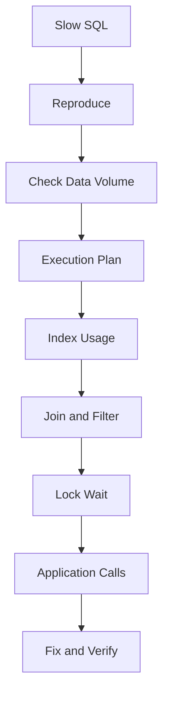

# Database and SQL Core Interview

## Overview

Database 면접에서는 SQL 문법보다 데이터 정합성, transaction, index, 성능, 장애 조사 관점을 확인한다.

현재 경력에서는 Oracle, PostgreSQL, SQL Server 경험을 중심으로 답변할 수 있다.

---

## Important Concepts

| Concept | Interview Point |
|---|---|
| SQL | 정확한 데이터 조회와 변경 |
| Index | 검색 성능과 write cost |
| Transaction | ACID, commit, rollback |
| Lock | 동시성, 대기, deadlock |
| Execution Plan | 성능 문제 조사 |
| Data Integrity | 업무 시스템의 핵심 품질 |

---

## Expected Questions

| Level | Question |
|---|---|
| Basic | SQLでJOINとは何ですか。 |
| Basic | Primary KeyとForeign Keyの違いは何ですか。 |
| Intermediate | Indexを使うメリットとデメリットは何ですか。 |
| Intermediate | Transactionとは何ですか。 |
| Advanced | Deadlockが発生した場合どう調査しますか。 |
| Advanced | SQLが遅い場合、どのように調査しますか。 |
| Expert | データ不整合を防ぐために何を設計しますか。 |

---

## Japanese Model Answers

### Q1. Indexを使うメリットとデメリットは何ですか。

```text
Indexのメリットは、検索条件や結合条件に利用されるカラムに対して、
データ検索を高速化できる点です。

一方で、Indexを増やしすぎると、INSERT、UPDATE、DELETE時にIndexの更新コストが発生し、
書き込み性能やストレージ使用量に影響します。

そのため、実務では検索頻度、データ量、カーディナリティ、実行計画を確認しながら、
本当に必要なIndexかどうかを判断することが重要だと考えています。
```

### Q2. SQLが遅い場合、どのように調査しますか。

```text
SQLが遅い場合、まず再現条件と対象データ量を確認します。
その上で、実行計画を確認し、Indexが利用されているか、
不要なFull Scanが発生していないか、JOIN順序や条件に問題がないかを見ます。

また、SQL単体だけでなく、アプリケーション側で同じSQLを繰り返し実行していないか、
トランザクションが長くなってロック待ちが発生していないかも確認します。

改善する際は、Index追加、SQL修正、取得項目の見直し、処理単位の分割などを検討します。
```

---

## Korean Explanation

- Index 답변은 장점만 말하면 부족하다.
- SQL 성능 질문은 실행계획, 데이터량, index, lock, application 호출 횟수까지 넓혀야 한다.
- 금융 프로젝트의 Oracle SQL 조사 경험과 연결하면 좋다.

---

## Follow-up Questions

- Cardinalityとは何ですか。
- Composite Indexを設計する時の順序はどう考えますか。
- N+1問題とは何ですか。
- Transaction isolation levelを説明してください。
- Deadlockを防ぐにはどうしますか。
- `EXISTS`と`IN`の違いは何ですか。
- PostgreSQLとOracleで意識する違いはありますか。

---

## Technical Deep Dive

### SQL Performance Investigation



### Index Decision Checklist

- where 조건에 자주 사용되는가
- join 조건에 사용되는가
- order by / group by에 사용되는가
- 데이터 cardinality가 충분한가
- write 성능 저하를 감수할 가치가 있는가
- 실제 실행계획에서 사용되는가

---

## Checklist

- [ ] Index의 장단점을 설명할 수 있다.
- [ ] SQL 성능 조사 순서를 말할 수 있다.
- [ ] Transaction과 lock을 연결해서 설명할 수 있다.
- [ ] Oracle/PostgreSQL 경험을 프로젝트와 연결한다.

