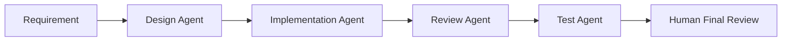

# AI-driven Development Interview

## Overview

AI 주도 개발은 단순히 AI에게 코드를 작성하게 하는 것이 아니다.

이 문서에서는 Claude Code를 중심으로 Rules, Agents, Skills를 설계하고, 요구사항 정의부터 설계, 구현, 리뷰, 테스트까지 개발 프로세스를 표준화한 경험을 면접 답변으로 정리한다.

---

## Important Concepts

| Concept | Meaning |
|---|---|
| AI-driven Development | AI가 개발 전 과정을 보조하는 프로세스 |
| Rules | 프로젝트 공통 규칙과 품질 기준 |
| Agents | 역할별 AI 작업자 |
| Skills | 반복 가능한 전문 작업 지식 |
| AI Review | AI 출력물의 품질 검증 |
| Human Control | 최종 판단은 개발자가 수행 |

---

## Expected Questions

| Level | Question |
|---|---|
| Basic | AI主導開発とは何ですか。 |
| Intermediate | Claude Codeをどのように使いましたか。 |
| Intermediate | Rules, Agents, Skillsの違いは何ですか。 |
| Advanced | AIの出力品質をどう担保しましたか。 |
| Advanced | AIを使う上でのリスクは何ですか。 |
| Expert | AI導入で開発プロセスはどう変わりましたか。 |

---

## Japanese Model Answers

### Q1. AI主導開発とは何ですか。

```text
私が考えるAI主導開発は、AIに単純にコードを書かせることではなく、
要件定義、設計、実装、レビュー、テストといった開発プロセス全体を、
AIと人間が役割分担しながら進める開発スタイルです。

Tokyo-Saneでは、Claude Codeを中心にRules、Agents、Skillsを設計し、
プロジェクトのルール、設計方針、レビュー観点、テスト観点をMarkdownとして整備しました。

その結果、AIの出力を毎回ゼロから指示するのではなく、
一定の品質基準に沿って再現性のある開発ができるようにしました。
ただし、最終的な判断や責任は開発者が持つべきだと考えており、
AIの出力は必ずレビューして利用するようにしています。
```

### Q2. AIの出力品質をどう担保しましたか。

```text
AIの出力品質を担保するために、まずプロジェクトのRulesを明確にしました。
コーディング規約、設計方針、セキュリティ観点、レビュー観点をMarkdownで整理し、
AIが判断に迷わないようにしました。

また、設計、実装、レビュー、テストの役割ごとにAgentsを分け、
一つのAI出力を別の観点で再確認する流れを作りました。

さらに、生成されたコードや設計はそのまま採用せず、
人間が差分、テスト結果、セキュリティ、保守性を確認してから反映しました。
AIは生産性を上げる手段ですが、品質保証の責任はエンジニア側にあると考えています。
```

---

## Korean Explanation

- “AI가 코드 작성”이라고 말하면 가볍게 들릴 수 있다.
- “개발 프로세스 표준화”, “재현성”, “리뷰 품질”을 강조한다.
- Human-in-the-loop 관점을 반드시 넣는다.
- 일본 면접에서는 AI를 과장하기보다 품질과 책임을 강조하는 편이 좋다.

---

## Follow-up Questions

- Rules에는 구체적으로 어떤 내용을 작성했나요?
- Agents를 역할별로 나눈 이유는 무엇인가요?
- AI가 잘못된 코드를 생성한 경우 어떻게 대응했나요?
- 보안 관점에서 AI 사용 시 주의한 점은 무엇인가요?
- AI導入前後で開発効率はどう変わりましたか。
- チームメンバーにAI活用をどう共有しましたか。
- AIを使わない方がよい場面はありますか。

---

## Technical Deep Dive

### AI Workflow



### Risk Management

| Risk | Countermeasure |
|---|---|
| 잘못된 구현 | 리뷰 Agent + 인간 리뷰 |
| 보안 취약점 | 보안 체크리스트 |
| 프로젝트 규칙 위반 | Rules 문서화 |
| 맥락 누락 | 요구사항 템플릿 |
| 과도한 의존 | 최종 판단은 개발자가 수행 |

---

## Checklist

- [ ] AI를 도구가 아니라 프로세스 관점으로 설명한다.
- [ ] Rules, Agents, Skills 차이를 말할 수 있다.
- [ ] AI 출력 품질 보증 방법을 설명한다.
- [ ] AI의 한계와 리스크를 함께 설명한다.

