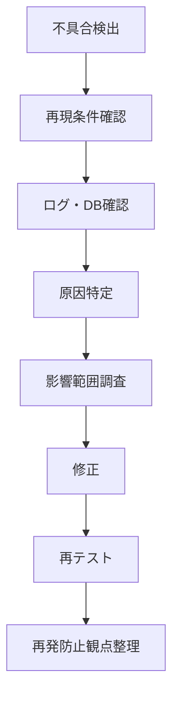

# 金融プロジェクト

## Overview

이 문서는 금융기관向け 프로젝트 경험을 일본 면접 답변으로 정리한다.

핵심 메시지는 다음이다.

- Java 기반 업무 시스템 개발 경험
- Oracle SQL과 데이터 조사 경험
- 배치 처리와 테스트 품질 경험
- 20건 이상의 불具合・潜在不具合 검출
- 담당 기능을 약 2주 앞당겨 완료

---

## Project Summary

| Item | Description |
|---|---|
| Period | 2024-08 ~ 現在 |
| Domain | 銀行・金融機関 |
| System | 有価証券管理, 債券管理, ローン返済照会 |
| Phase | 詳細設計, 実装, 単体テスト, 結合テスト, シナリオテスト |
| Role | Member |
| Language | Java 17 |
| Database | Oracle 12c |
| Tools | Eclipse, GitHub, AWS |
| Team | 全22名, チーム員8名 |

---

## Important Concepts

| Concept | Interview Point |
|---|---|
| 金融システム | 정확성, 안정성, 데이터 정합성 |
| Batch | 대량 데이터, 재처리, 예외 처리 |
| SQL | 데이터 조사, 성능, 영향 범위 |
| Test | 정상계, 이상계, 경계값, 회귀 |
| Quality | 잠재 결함 조기 검출 |

---

## Expected Questions

- 金融案件ではどのような機能を担当しましたか。
- バッチ処理で意識したことは何ですか。
- テスト工程でどのように品質を担保しましたか。
- 不具合を検出した際、どのように原因調査しましたか。
- 金融システムで特に重要だと思うことは何ですか。
- 予定より早く完了できた理由は何ですか。

---

## Interviewer's Intent

면접관은 금융 경험을 통해 다음을 확인한다.

- 정확성이 중요한 시스템을 경험했는가
- 데이터 정합성과 테스트를 중요하게 생각하는가
- 단순 구현자가 아니라 품질 관점이 있는가
- 장애나 불具合를 논리적으로 조사할 수 있는가

---

## Japanese Model Answers

### Q1. 金融案件ではどのような機能を担当しましたか。

```text
金融機関向けの有価証券管理、債券管理、ローン返済照会システムの開発に携わりました。

主にJavaを用いたバッチ機能の詳細設計、実装、単体テスト、結合テストを担当し、
OracleでのSQL作成やデータ調査、不具合原因の分析も行いました。

金融システムでは、処理結果の正確性やデータ整合性が非常に重要なため、
実装だけでなく、テスト観点や影響範囲の確認を特に意識していました。
```

### Q2. テスト工程でどのように品質を担保しましたか。

```text
テスト工程では、仕様書通りの正常系だけでなく、
境界値、異常系、既存データとの組み合わせ、後続処理への影響を意識して確認しました。

不具合を検出した場合は、単に修正するだけではなく、
原因、影響範囲、同様の問題が他の機能にないかを確認するようにしました。

その結果、20件以上の不具合や潜在的な問題を検出し、
後続工程での手戻り削減と品質向上に貢献できたと考えています。
```

### Q3. 予定より早く完了できた理由は何ですか。

```text
予定より早く完了できた理由は、実装前に処理内容と確認観点を整理し、
手戻りを減らす進め方を意識したためです。

特にバッチ処理では、入力データ、処理条件、出力結果、異常時の挙動を事前に確認し、
実装後すぐに検証できるようにしました。

また、不明点を早めに確認し、問題を後工程に残さないようにしたことで、
結果として担当機能を約2週間前倒しで完了できました。
```

---

## Korean Explanation

- 금융 프로젝트는 “정확성・정합성・품질”이 핵심 키워드다.
- 일정 단축은 “빨리 코딩했다”가 아니라 “사전 정리와 손戻り 감소”로 설명한다.
- 불具合 20건은 강력한 수치이므로 STAR 답변에도 재사용한다.

---

## Follow-up Questions

- バッチ処理の入力・出力はどのように確認しましたか。
- Oracle SQLで性能を意識した経験はありますか。
- データ不整合が起きた場合、どう調査しますか。
- テスト観点は誰が決めましたか。
- 金融システムでログはなぜ重要ですか。
- 障害時に最初に確認する情報は何ですか。
- 同じ不具合を再発させないために何をしますか。

---

## Technical Deep Dive

### Batch Quality Checklist

- 입력 데이터 조건
- 처리 대상 추출 SQL
- 정상 처리 결과
- 예외 처리 결과
- 재실행 가능성
- 로그 출력
- commit / rollback
- 후속 처리 영향

### Defect Analysis Flow



---

## Good Answer Example

- 담당 기능과 기술이 명확하다.
- 금융 시스템의 품질 기준을 이해하고 있다.
- 실제 성과 수치가 있다.
- 불具合 조사 프로세스를 설명할 수 있다.

---

## Bad Answer Example

```text
金融案件でJavaの開発をしました。
テストもしました。不具合も修正しました。
```

문제점:

- 금융 시스템다운 관점이 없다.
- 어떤 기능을 담당했는지 모호하다.
- 품질 기여가 약하다.

---

## Checklist

- [ ] 금융 시스템의 중요 키워드를 말할 수 있다.
- [ ] 배치 처리에서 주의할 점을 설명할 수 있다.
- [ ] 20건 이상 불具合 검출 경험을 STAR로 말할 수 있다.
- [ ] 약 2주 앞당긴 이유를 논리적으로 설명할 수 있다.

